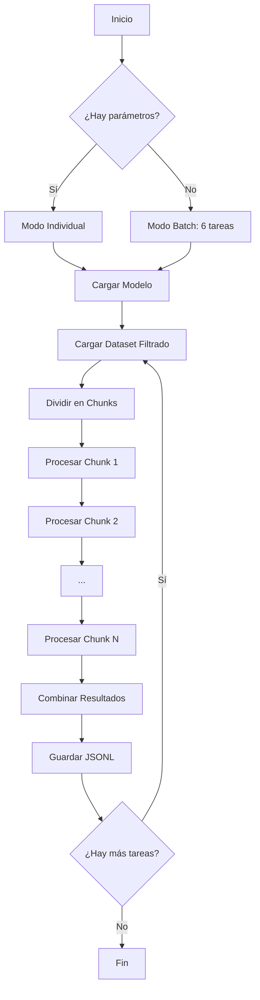

# 🚀 Generador de Hard Negatives - Versión Optimizada

Script optimizado para generar hard negatives a partir de datasets de queries y passages, diseñado para ejecutarse eficientemente en clusters HPC con GPUs, evitando problemas de memoria (OOM).
Script: `generar_hard_negatives_parametrizado.py`

## 📋 Tabla de Contenidos

- [Descripción](#-descripción)
- [Características](#-características)
- [Requisitos](#-requisitos)
- [Instalación](#-instalación)
- [Uso](#-uso)
- [Configuración](#-configuración)
- [Ejemplos](#-ejemplos)
- [Solución de Problemas](#-solución-de-problemas)
- [Estructura del Código](#-estructura-del-código)
- [Outputs](#-outputs)

---

## 📖 Descripción

Este script procesa datasets de preguntas (queries) y pasajes (passages) para generar **hard negatives** utilizando modelos de embeddings. Los hard negatives son ejemplos negativos que son semánticamente similares a los positivos, pero no son respuestas correctas, lo que mejora el entrenamiento de modelos de recuperación de información.

### ¿Qué son los Hard Negatives?

Los hard negatives son pasajes que:
- Tienen alta similitud semántica con la query
- NO son la respuesta correcta
- Son más difíciles de distinguir que negativos aleatorios
- Mejoran significativamente el rendimiento de modelos de retrieval

---

## ✨ Características

- ✅ **Procesamiento por chunks**: Evita problemas de memoria (OOM) dividiendo el dataset en bloques pequeños
- ✅ **Modo batch automático**: Ejecuta 6 tareas predefinidas sin intervención
- ✅ **Modo individual**: Ejecuta una tarea específica con parámetros personalizados
- ✅ **Optimizado para GPU**: Usa CUDA cuando está disponible
- ✅ **FAISS**: Usa índices FAISS para acelerar la búsqueda de negativos
- ✅ **Monitoreo en tiempo real**: Muestra uso de RAM y GPU durante ejecución
- ✅ **Recuperación ante errores**: Continúa procesando si falla un chunk individual
- ✅ **Salida segura**: Escritura con `fsync` para sistemas de archivos distribuidos (Lustre)
- ✅ **Configurable**: Tamaño de chunks ajustable según recursos disponibles

---

## 📦 Requisitos

### Librerías Python
```bash
sentence-transformers
polars
datasets
torch
psutil
```

### Recursos Recomendados

| Dataset Size | RAM Mínima | GPU VRAM | Chunk Size |
|-------------|-----------|----------|------------|
| < 100k filas | 64 GB | 16 GB | 100,000 |
| 100k - 500k | 120 GB | 24 GB | 50,000 |
| 500k - 1M | 180 GB | 40 GB | 30,000 |
| > 1M filas | 250 GB | 80 GB | 20,000 |

---

## 🔧 Instalación

### 1. Preparar el directorio de trabajo
```bash
cd /ruta/al/proyecto
```

### 2. Crear Entorno Conda
```bash
conda create -n negatives_env python=3.10
conda activate negatives_env
```

### 3. Instalar Dependencias
```bash
pip install sentence-transformers polars datasets torch psutil
```

### 4. Verificar CUDA (opcional pero recomendado)
```bash
python -c "import torch; print(f'CUDA disponible: {torch.cuda.is_available()}')"
```

---

## 🎯 Uso

### **Modo 1: Ejecutar TODAS las Tareas (Por Defecto)**

Ejecuta automáticamente las 6 combinaciones predefinidas:
```bash
python generar_hard_negatives_parametrizado.py \
  --model-path /ruta/al/modelo \
  --dataset-path /ruta/al/dataset.jsonl \
  --output-dir hard_negatives_generados
```

**Tareas que se ejecutarán:**

1. `dataset_facil_random` → high_school + random
2. `dataset_medio_random` → university + random
3. `dataset_dificil_random` → phd + random
4. `dataset_facil_top` → high_school + top
5. `dataset_medio_top` → university + top
6. `dataset_dificil_top` → phd + top

### **Modo 2: Ejecutar UNA Tarea Específica**
```bash
python generar_hard_negatives_parametrizado.py \
  --model-path /ruta/al/modelo \
  --dataset-path /ruta/al/dataset.jsonl \
  --filtro FILTRO \
  --estrategia ESTRATEGIA \
  --nombre NOMBRE
```

**Parámetros:**
- `--model-path`: ruta del modelo `SentenceTransformer`
- `--dataset-path`: ruta del dataset JSONL/NDJSON
- `--output-dir`: directorio de salida
- `--filtro`: nivel de dificultad (`high_school`, `university`, `phd`)
- `--estrategia`: método de sampling (`random`, `top`)
- `--nombre`: nombre del archivo de salida (sin extensión)

**Ejemplo:**
```bash
python generar_hard_negatives_parametrizado.py \
  --model-path /ruta/al/modelo \
  --dataset-path /ruta/al/dataset.jsonl \
  --filtro phd \
  --estrategia top \
  --nombre dataset_dificil_top
```

### **Modo 3: Ajustar Chunk Size**

Si experimentas problemas de memoria:
```bash
# Para todas las tareas
python generar_hard_negatives_parametrizado.py \
  --model-path /ruta/al/modelo \
  --dataset-path /ruta/al/dataset.jsonl \
  --chunk-size 30000

# Para una tarea específica
python generar_hard_negatives_parametrizado.py \
  --model-path /ruta/al/modelo \
  --dataset-path /ruta/al/dataset.jsonl \
  --filtro university \
  --estrategia random \
  --nombre test \
  --chunk-size 25000
```

---

## ⚙️ Configuración

### Rutas de entrada y salida
```bash
python generar_hard_negatives_parametrizado.py \
  --model-path /ruta/a/tu/modelo \
  --dataset-path /ruta/a/tu/dataset.jsonl \
  --output-dir hard_negatives_generados
```

### Parámetros de Mining (editar en `generacion_hard_negatives()`)
```python
dataset_hard_negatives = mine_hard_negatives(
    dataset=hf_dataset,
    model=model,
    output_scores=True,
    range_min=10,           # Mínimo rango de candidatos
    range_max=50,           # Máximo rango de candidatos
    max_score=0.8,          # Similitud máxima permitida
    relative_margin=0.05,   # Margen relativo
    num_negatives=5,        # Cantidad de negativos por query
    sampling_strategy=sampling_strategy,
    batch_size=16,          # Ajustar según GPU
    use_faiss=True,
    anchor_column_name="query",
    positive_column_name="passage"
)
```

### Launcher SLURM (launcher.sh)
```bash
#!/bin/bash
#SBATCH --job-name=hard_negatives
#SBATCH --output="logs/%A_%x.out"
#SBATCH --error="logs/%A_%x.err"
#SBATCH --gres=gpu:1              # Número de GPUs
#SBATCH --time=1-00:00:00         # Tiempo máximo
#SBATCH --cpus-per-task=16        # CPUs por tarea
#SBATCH --mem=180GB               # RAM total

conda activate negatives_env

# Monitoreo GPU (opcional)
nvidia-smi --query-gpu=timestamp,memory.used,memory.total,utilization.gpu \
           --format=csv -l 60 > logs/${SLURM_JOB_ID}_gpu_monitor.csv &
MONITOR_PID=$!

# Ejecutar
python generar_hard_negatives_parametrizado.py \
  --model-path "$MODEL_PATH" \
  --dataset-path "$DATASET_PATH" \
  --output-dir hard_negatives_generados

# Limpiar
kill $MONITOR_PID 2>/dev/null || true
```

---

## 💡 Ejemplos

### Ejemplo 1: Procesamiento Completo por Defecto
```bash
# Crear directorio de logs
mkdir -p logs

# Lanzar todas las tareas
sbatch launcher.sh

# Monitorear progreso
tail -f logs/JOBID_hard_negatives.out

# Ver uso de GPU
watch -n 5 nvidia-smi
```

### Ejemplo 2: Solo Dataset Universitario con Top Strategy
```bash
python generar_hard_negatives_parametrizado.py \
    --model-path /ruta/al/modelo \
    --dataset-path /ruta/al/dataset.jsonl \
    --filtro university \
    --estrategia top \
    --nombre mi_dataset_custom
```

### Ejemplo 3: Procesamiento con Recursos Limitados
```bash
# Reducir chunk size para evitar OOM
python generar_hard_negatives_parametrizado.py \
    --model-path /ruta/al/modelo \
    --dataset-path /ruta/al/dataset.jsonl \
    --chunk-size 20000
```

### Ejemplo 4: Debug en Modo Interactivo
```bash
# Solicitar nodo interactivo
srun --gres=gpu:1 --mem=120GB --pty bash

# Activar entorno
conda activate negatives_env

# Ejecutar directamente
python generar_hard_negatives_parametrizado.py \
  --model-path /ruta/al/modelo \
  --dataset-path /ruta/al/dataset.jsonl \
  --filtro high_school \
  --estrategia random \
  --nombre test_debug \
  --chunk-size 10000
```

---

## 🐛 Solución de Problemas

### Error: OOM (Out of Memory) Killed

**Síntoma:**
```
error: Detected 1 oom_kill event in StepId=XXXXX
```

**Soluciones:**

1. **Reducir chunk size:**
```bash
   --chunk-size 20000  # o menos
```

2. **Aumentar memoria SLURM:**
```bash
   #SBATCH --mem=250GB
```

3. **Reducir batch size:**
```python
   batch_size=8  # En lugar de 16
```

### Error: CUDA Out of Memory

**Síntoma:**
```
RuntimeError: CUDA out of memory
```

**Soluciones:**

1. **Reducir batch size:**
```python
   batch_size=32  # En generacion_hard_negatives()
```

### Error: Módulos No Encontrados

**Síntoma:**
```
ModuleNotFoundError: No module named 'sentence_transformers'
```

**Solución:**
```bash
conda activate negatives_env
pip install sentence-transformers polars datasets torch psutil
```

### Warning: Archivo No Aparece en `ls`

**Síntoma:**
El script dice que guardó el archivo pero no aparece en el directorio.

**Causa:**
Sistema de archivos distribuido (Lustre) con caché.

**Solución:**
El script ya incluye `os.fsync()` que fuerza la escritura. Espera 1-2 minutos y el archivo aparecerá.

### Performance: Muy Lento

**Soluciones:**

1. **Aumentar batch size:**
```python
   batch_size=256
```

2. **Usar chunks más grandes:**
```bash
   --chunk-size 100000
```

---

## 🏗️ Estructura del Código
```
generar_hard_negatives_parametrizado.py
│
├── monitorear_memoria()          # Monitoreo de RAM/GPU
├── cargar_modelo()                # Carga modelo de embeddings
├── cargar_dataset_completo()      # Carga dataset filtrado (Polars)
├── generacion_hard_negatives()    # Mining con FAISS
├── guardar_resultados()           # Escritura segura a disco
├── procesar_por_chunks()          # Procesamiento por bloques
├── parse_args()                   # Parser de argumentos CLI
├── ejecutar_tarea()               # Ejecutor de tarea individual
└── main()                         # Orquestador principal
```

### Flujo de Ejecución


---

## 📤 Outputs

### Ubicación de Archivos
```
hard_negatives_generados/
├── hard_negatives_dataset_facil_random.jsonl
├── hard_negatives_dataset_facil_top.jsonl
├── hard_negatives_dataset_medio_random.jsonl
├── hard_negatives_dataset_medio_top.jsonl
├── hard_negatives_dataset_dificil_random.jsonl
└── hard_negatives_dataset_dificil_top.jsonl
```

### Formato de Salida (JSONL)

Cada línea contiene:
```json
{
  "query": "¿Cuál es la capital de España?",
  "passage": "Madrid es la capital y ciudad más poblada de España.",
  "negative_passages": [
    "Barcelona es la segunda ciudad más grande de España.",
    "Sevilla es conocida por su arquitectura mudéjar.",
    "Valencia es famosa por su Ciudad de las Artes.",
    "Bilbao es el centro económico del País Vasco.",
    "Zaragoza es la quinta ciudad más poblada de España."
  ],
  "negative_scores": [0.78, 0.75, 0.72, 0.71, 0.69]
}
```

### Logs
```
logs/
├── JOBID_hard_negatives.out       # Salida estándar
├── JOBID_hard_negatives.err       # Errores
└── JOBID_gpu_monitor.csv          # Monitoreo GPU (si está habilitado)
```

---

## 📊 Monitoreo en Tiempo Real

### Ver Progreso
```bash
# Logs en tiempo real
tail -f logs/$(ls -t logs/*.out | head -1)

# Uso de GPU
watch -n 2 nvidia-smi

# Uso de memoria
watch -n 2 'free -h && echo "---" && df -h /home'

# Ver trabajos en cola
squeue -u $USER
```

### Cancelar Trabajo
```bash
scancel JOBID
```

---

## 🔬 Estrategias de Sampling

### `random`
- Selecciona negativos aleatoriamente del rango especificado
- Más diversidad pero menos "difíciles"
- Recomendado para datasets grandes

### `top`
- Selecciona los negativos más similares
- Más "difíciles" pero menos diversidad
- Recomendado para fine-tuning específico

---

## 📈 Recomendaciones de Uso

### Para Datasets Pequeños (< 100k)
```bash
python generar_hard_negatives_parametrizado.py --model-path /ruta/modelo --dataset-path /ruta/dataset.jsonl --filtro high_school --estrategia top --nombre test --chunk-size 100000
```

### Para Datasets Medianos (100k - 500k)
```bash
python generar_hard_negatives_parametrizado.py --model-path /ruta/modelo --dataset-path /ruta/dataset.jsonl --filtro university --estrategia random --nombre test --chunk-size 50000
```

### Para Datasets Grandes (> 1M)
```bash
# Usar modo batch con chunk-size reducido
python generar_hard_negatives_parametrizado.py --model-path /ruta/modelo --dataset-path /ruta/dataset.jsonl --chunk-size 30000
```

### Para Máxima Velocidad (GPU potente)
```python
# Editar en el script:
batch_size=32
```

### Para Mínima Memoria
```python
# Editar en el script:
batch_size=8
```

---

## 🤝 Contribuciones

Para reportar bugs o sugerir mejoras:
1. Revisa la sección de [Solución de Problemas](#-solución-de-problemas)
2. Incluye logs completos (.out y .err)
3. Especifica recursos usados (RAM, GPU, chunk_size)

---

## 📝 Changelog

### v2.0 (Actual)
- ✅ Procesamiento por chunks para evitar OOM
- ✅ Modo batch automático (6 tareas)
- ✅ Monitoreo de memoria en tiempo real
- ✅ FAISS en CPU por defecto
- ✅ Recuperación ante errores
- ✅ Escritura segura con fsync

### v1.0 (Anterior)
- ❌ Cargaba todo el dataset en memoria
- ❌ OOM con datasets > 500k

---

## 📄 Licencia

Consulta la licencia del repositorio principal.

---

## Herramientas

- **sentence-transformers**: Framework de embeddings
- **Polars**: Procesamiento eficiente de datos
- **FAISS**: Búsqueda de vectores similares

---

**Última actualización:** Febrero 2026
