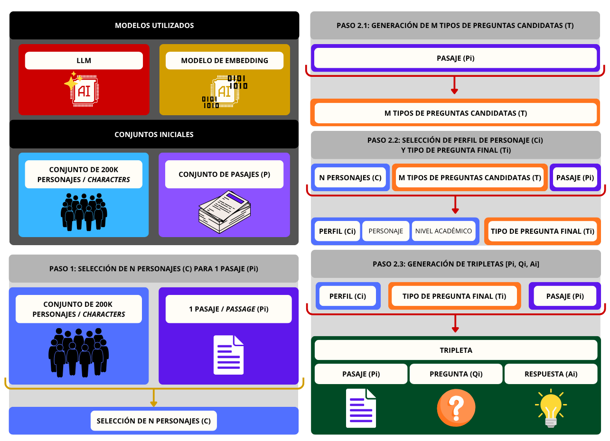

**Flujo para la generación de datos sintéticos para entrenamiento de modelos de embeddings y reranker**

Descripción detallada del proceso completo para crear un dataset de datos sintéticos destinado al entrenamiento de modelos de embeddings y reranker.

*Alba María Mármol Romero, Adrián Moreno Muñoz, Sara Dueñas Romero | amarmol@ujaen.es, ammunoz@ujaen.es, sduenas@ujaen.es | Proyecto Vandelvira*

# Flujo de Trabajo a Seguir

Este documento explica cómo crear un nuevo dataset de datos sintéticos para el entrenamiento específico de modelos bi-encoders y cross-encoders. El procedimiento consta de pasos fijos que deben realizarse en el orden indicado, siguiendo la metodología establecida por modelos como Qwen.

- [Paso 1: Obtener los N personajes más relevantes dado un contexto](#paso-1-obtener-los-n-personajes-más-relevantes-dado-un-contexto)
- [Paso 2: Generación de Tripletas Sintéticas [P, Q, A]](#paso-2-generación-de-tripletas-sintéticas-p-q-a)
- [Paso 3: Minería de *hard negatives*](#paso-3-minería-de-hard-negatives)

A continuación, se muestra un diagrama que ilustra la metodología descrita:

## Paso 1: Obtener los N personajes más relevantes dado un contexto

### Entrada

- Dataset de Personajes (*Characters*) del Persona Hub [(Ge et al., 2024)](https://arxiv.org/abs/2406.20094).
- Conjunto (``P``) de fragmentos o pasajes (*Passages*).

### Proceso

1. **Extracción de Fragmento (*passage*):** Se extrae un pasaje (``Pi``) del conjunto.
2. **Vectorización del Fragmento:** El fragmento se representa mediante un embedding.
3. **Vectorización del dataset de Personajes:** Cada personaje tiene su embedding correspondiente.
4. **Cálculo de Similitud:** Se calcula la similitud coseno entre el embedding del fragmento y los embeddings de cada personaje.
5. **Selección del top-N:** Se seleccionan los N personajes o *characters* (`C`) con mayor similitud respecto al fragmento.
   - N = 5

#### Ejemplo

> **Pasaje de texto del dataset "Biblioteca_Jurídica" correspondiente al documento con identificador "56"** Pi
> A este fin, han designado por sus Plenipotenciarios:
> Su Excelencia el Jefe del Estado Español, a su Embajador en Santo Domingo, excelentísimo señor don Gabriel Martínez de Mata, y Su Excelencia el Presidente de la República Dominicana, al Secretario de Estado de Relaciones Exteriores, excelentísimo señor Doctor Fernando A. Amiama Tió.
> Quienes, después de haber cambiado sus Plenos poderes, hallados en buena y debida forma, han convenido en los artículos siguientes:
> Artículo 1. Los españoles y dominicanos podrán adquirir la nacionalidad dominicana o española, respectivamente, en las condiciones y en la forma prevista por la legislación en vigor en cada una de las Partes Contratantes sin perder por ello su anterior nacionalidad. La calidad de nacionales se acreditará ante la Autoridad competente, a la vista de los documentos que ésta estime necesarios. 
> Artículo 2. Los españoles que hayan adquirido la nacionalidad dominicana y los dominicanos que hayan adquirido la nacionalidad española de conformidad con el artículo anterior, serán inscritos en los Registros que determine la Nación donde se adquiera la nueva nacionalidad.

> **Personajes seleccionados**
> - A Spaniard taking pride in the history of Spanish surnames
> - An immigration attorney from Dominican Republic who struggled with English as a second language
> - A casual Dominican citizen who has lived abroad for many years
> - A native Spanish speaker from Spain who is interested in learning Jamaican Patois
> - A Spaniard residing in Jamaica who is Spanish teacher

## Paso 2: Generación de Tripletas Sintéticas [P, Q, A]

### Objetivo

Generar una **pregunta** (**query**) desde la perspectiva del personaje seleccionado, ajustando el contenido, tipo, dificultad y longitud requerida. Estas preguntas, junto a su **fragmento de origen** (**passage**) y la **respuesta** (**answer**) de la pregunta, teniendo en cuenta el fragmento forman el dataset sintético final.

Así, generamos una tripleta tal que [Pi, Qi, Ai]
- **Pi**: pasaje (*passage*)
- **Qi**: pregunta sintética (*query*)
- **Ai**: respuesta sintética (*answer*)

### Entradas

- Pasaje de texto (*passage*) ``Pi``
- Personajes seleccionados `N Characters`

### Métodos

- **Construcción del prompt:** Se elabora un prompt detallado para el modelo que guía la generación según personaje, fragmento y parámetros.
- **Llamada al modelo generador:** Uso de un modelo LLM (ej. Qwen, Mistral) para generar la pregunta en base al prompt.
- **Postprocesado:** Extracción de la pregunta en formato JSON desde la respuesta del modelo.
- **Generación del dataset:** Incorporación de la tripleta (**query**, **passage**, **answer**) al dataset final.

### Proceso

1. **Generación de M Tipos de Pregunta**: Pasaje de entrada (``Pi``), el modelo de lenguaje crea un conjunto de **M Tipos de Preguntas Candidatas** (`T`) que se podrían hacer dado ese pasaje.
   - M = 5

> **M Tipos de Preguntas Candidatas** (T)
> - keywords
> - background
> - acquire_knowledge
> - summary
> - procedural

2. **Selección de Perfil y Tipo Final de Pregunta**: Dada la selección de N *Characters* (`C`), los M Tipos de Preguntas Candidatas (`T`) y el pasaje de entrada (``Pi``), el modelo de lenguaje crea un Perfil y escoge el Tipo Final de Pregunta:
   - **Perfil de Personaje** `Ci`: personaje (*character*) y nivel académico o dificultad (*difficulty*)
   - **Tipo Final de Pregunta** `Ti`

> **Perfil de Personaje** Ci
> *Persona*
> Immigration attorney from Dominican Republic who struggled with English as a second language
> *Nivel Académico*
> University

> **Tipo Final de Pregunta** Ti
> acquire_knowledge

3. **Generación de Preguntas y Respuestas Sintéticas**: Dado el Perfil (`Ci`) [personaje y dificultad], el Tipo Final de Pregunta (`Ti`) y el pasaje de entrada (``Pi``), el modelo de lenguaje crea, ajustando detalles como la longitud o el idioma:
   1. **Pregunta concreta** (``Qi``)
   2. **Respuesta concreta** (``Ai``)

> **Pregunta sintética** Qi
> ¿Cómo permite el acuerdo entre España y República Dominicana adquirir la dualidad de nacionalidad sin perder la anterior, según artículos 1 y 2?

> **Respuesta sintética** Ai
> El acuerdo permite adquirir la dualidad de nacionalidad sin perder la anterior mediante la adquisición de la nacionalidad dominicana o española en las condiciones y forma previstas por la legislación vigente en cada Parte Contratante, y mediante la inscripción en los Registros que determine la Nación donde se adquiera la nueva nacionalidad.

#### Tripleta final de ejemplo

Dataset "Biblioteca_Jurídica" correspondiente al documento con identificador "56"

> **Pasaje de texto** Pi
> A este fin, han designado por sus Plenipotenciarios:
> Su Excelencia el Jefe del Estado Español, a su Embajador en Santo Domingo, excelentísimo señor don Gabriel Martínez de Mata, y Su Excelencia el Presidente de la República Dominicana, al Secretario de Estado de Relaciones Exteriores, excelentísimo señor Doctor Fernando A. Amiama Tió.
> Quienes, después de haber cambiado sus Plenos poderes, hallados en buena y debida forma, han convenido en los artículos siguientes:
> Artículo 1. Los españoles y dominicanos podrán adquirir la nacionalidad dominicana o española, respectivamente, en las condiciones y en la forma prevista por la legislación en vigor en cada una de las Partes Contratantes sin perder por ello su anterior nacionalidad. La calidad de nacionales se acreditará ante la Autoridad competente, a la vista de los documentos que ésta estime necesarios. 
> Artículo 2. Los españoles que hayan adquirido la nacionalidad dominicana y los dominicanos que hayan adquirido la nacionalidad española de conformidad con el artículo anterior, serán inscritos en los Registros que determine la Nación donde se adquiera la nueva nacionalidad.

> **Pregunta sintética** Qi
> ¿Cómo permite el acuerdo entre España y República Dominicana adquirir la dualidad de nacionalidad sin perder la anterior, según artículos 1 y 2?

> **Respuesta sintética** Ai
> El acuerdo permite adquirir la dualidad de nacionalidad sin perder la anterior mediante la adquisición de la nacionalidad dominicana o española en las condiciones y forma previstas por la legislación vigente en cada Parte Contratante, y mediante la inscripción en los Registros que determine la Nación donde se adquiera la nueva nacionalidad.

## Paso 3: Minería de Hard negatives

Este paso es clave para formar tripletas necesarias para el entrenamiento de modelos de embeddings y reranker. La calidad del modelo depende de la calidad de los negativos, divididos en:

- **Soft negatives:** fragmentos completamente irrelevantes.
- **Hard negatives:** fragmentos que aparentan relevancia, pero no lo son.

### Opciones para generar negativos:

1. Usar un framework:
   - SentenceTransformer: función `mine_hard_negatives`.
2. Manualmente:
   - TFIDF.
   - Similitud de coseno.

En este proyecto, se emplea la función `mine_hard_negatives` de SentenceTransformer para la minería de negativos.

# Más información
* [Qwen3 Embedding: Advancing Text Embedding and Reranking Through Foundation Models](https://arxiv.org/pdf/2506.05176)
