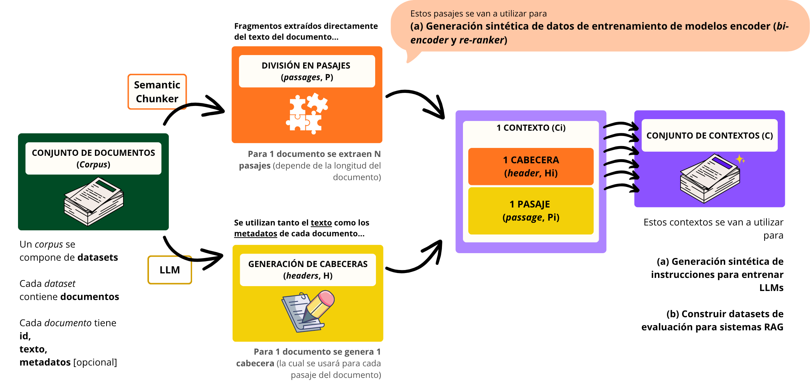

# Documentación: Sistema de Agregación de Contextos Enriquecidos

Este sistema une fragmentos de texto (chunks) con sus cabeceras y clasificaciones generadas por LLM para crear "contextos" enriquecidos que combinan metadatos descriptivos con contenido textual, optimizados para sistemas de recuperación de información.

## Objetivo General

El sistema procesa dos fuentes de datos (chunks semánticos y headers generados) para crear un dataset unificado de "contextos" donde cada fragmento de texto está enriquecido con una cabecera descriptiva, clasificación categórica y metadatos completos, facilitando la recuperación contextualizada y mejorando la calidad de embeddings para sistemas RAG y búsqueda semántica.



## Arquitectura del Sistema

### 1. Script con el pipeline principal: `aggregate_contexts.py`

Script principal que implementa el pipeline completo de agregación y enriquecimiento de contextos mediante operaciones de join, concatenación y cálculo de tokens.

#### Funciones del Pipeline

**`setup_logging()`**

Configura el sistema de logging con nivel personalizable (DEBUG, INFO, WARNING, ERROR, CRITICAL) y formato estandarizado que incluye timestamp, nombre del logger, nivel y mensaje.

**`load_config()`**

Carga la configuración desde `config.yaml` con validación de existencia del archivo y manejo robusto de errores YAML, retornando diccionario con todas las configuraciones del sistema y registrando información de debug sobre parámetros cargados.

**`count_tokens()`**

Calcula el número de tokens de un texto usando tiktoken con el encoding especificado (cl100k_base por defecto), validando que el input sea string no vacío y retornando 0 en caso de error o texto nulo.

**`load_parquet_files()`**

Carga los archivos Parquet de chunks y headers validando su existencia, registra información sobre dimensiones (filas/columnas) y nombres de columnas, y genera automáticamente columnas de validación en headers: `tokens` (conteo con tiktoken) y `valid` (booleano indicando si tokens < 500), sobrescribiendo el archivo original de headers con estas nuevas columnas.

**`validate_dataframes()`**

Valida que los DataFrames tengan las columnas requeridas según el esquema esperado:
- Chunks: `source_id`, `id_document`, `id_chunk`, `chunk` (más `valid` si require_valid_column=True)
- Headers: `source_id`, `id`, `header`, `classification` (más `valid` si require_valid_column=True)

Adicionalmente verifica tipos de datos de la columna `valid` (debe ser Boolean) y registra distribución de valores true/false con advertencias si el tipo no coincide.

**`prepare_headers_dataframe()`**

Prepara el DataFrame de headers seleccionando solo columnas necesarias (`source_id`, `id`, `header`, `classification`, `tokens`, `valid`) y renombra la columna `id` a `id_document` para mantener consistencia con el esquema de chunks y facilitar el join posterior.

**`join_chunks_with_headers()`**

Realiza la operación de join entre chunks y headers basándose en las claves compuestas `source_id` e `id_document`, con las siguientes características:

- **Filtrado previo**: Aplica filtrado por la columna `valid` según el valor booleano configurado (validation_value), eliminando chunks/headers no válidos antes del join
- **Estadísticas de filtrado**: Calcula y registra cantidad de registros eliminados, porcentajes de remoción y advertencias si se eliminan todos los registros
- **Tipo de join configurable**: Soporta "left" (mantiene todos los chunks) o "inner" (solo chunks con header asociado)
- **Detección de nulos**: Identifica y reporta chunks sin header asociado después del join
- **Manejo de columna ausente**: Si la columna `valid` no existe, emite warning y procede sin filtrar

**`_statistics()`**

Calcula estadísticas descriptivas de la distribución de tokens en los contextos generados: mínimo, máximo, media y mediana, además del tamaño total del dataset, escribiendo estos valores en un archivo de texto especificado (readme_file) para documentación y análisis posterior.

**`create_context_and_tokens()`**

Genera la columna `context` concatenando header y chunk con el separador configurado (por defecto "\n\n"), manejando valores nulos con fill_null(""), y calcula el número de tokens de cada contexto usando tiktoken con el encoding especificado, invocando `_statistics()` para generar reporte de distribución de tokens.

**`select_output_columns()`**

Selecciona y ordena las columnas finales del DataFrame de salida en el siguiente orden estándar: `source_id`, `id_document`, `id_chunk`, `header`, `chunk`, `context`, `tokens`, `classification`, registrando información sobre dimensiones finales y estructura del dataset.

**`save_output()`**

Persiste el DataFrame resultante en el formato especificado (Parquet o CSV), creando directorios si no existen, y adicionalmente genera versión JSONL cuando el formato es Parquet, registrando tamaño del archivo en MB y confirmación de guardado exitoso.

**`main()`**

Función principal que orquesta el flujo completo de procesamiento:

1. Carga configuración desde `config.yaml`
2. Configura logging según nivel especificado
3. Extrae parámetros (formato, separador, encoding, tipo de join, validación)
4. Establece directorio de caché de tiktoken
5. Carga archivos Parquet de chunks y headers
6. Valida estructura de DataFrames
7. Prepara headers renombrando columnas
8. Realiza join con filtrado por validación
9. Crea contextos concatenados y calcula tokens
10. Selecciona columnas finales
11. Guarda resultado en formato especificado

Incluye manejo comprehensivo de excepciones con logging detallado y trazabilidad completa.

#### Punto de Entrada

El bloque `if __name__ == "__main__"` itera sobre la lista de sources definida en `config.yaml`, procesando cada source de forma independiente: construye rutas específicas para chunks, headers y output basándose en el nombre del source, e invoca `main()` para cada combinación, permitiendo procesamiento batch de múltiples datasets.

### 2. Fichero de configuración: `config.yaml`

Archivo de configuración centralizado que define todos los parámetros del sistema de agregación.

#### Configuraciones por Sección

**Sources**

Lista de identificadores de sources a procesar (source_1, source_2...), utilizada para iterar y procesar múltiples datasets de forma automatizada en el punto de entrada del script.

**Input (Rutas de Entrada)**

- `chunks_path`: Directorio que contiene archivos Parquet de chunks semánticos generados por el sistema de chunking (.../passages/{domain}/)
- `headers_path`: Directorio que contiene archivos Parquet de headers generados por LLM (.../headers/{domain}/)

**Output (Configuración de Salida)**

- `path`: Directorio de destino para contextos generados (.../contexts/{domain}/)
- `format`: Formato de archivo de salida ("parquet" o "csv")

**Processing (Parámetros de Procesamiento)**

- `join_type`: Tipo de join SQL ("left" mantiene todos los chunks, "inner" solo chunks con header)
- `separator`: Cadena utilizada para separar header y chunk al crear el context (por defecto "\n")
- `tiktoken_dir`: Directorio de caché para tiktoken
- `tiktoken_encoding`: Encoding de tiktoken a utilizar (cl100k_base para GPT-4/GPT-3.5-turbo/text-embedding-ada-002/text-embedding-3-small/large, p50k_base para Codex/text-davinci-002/003)

**Validation (Configuración de Validación)**

- `validation`: Valor booleano para filtrar columna `valid` (true procesa solo chunks/headers válidos, false procesa solo no válidos)
- `require_valid_column`: Si true, requiere que exista la columna `valid` (lanza error si no existe); si false, solo muestra warning y continúa sin filtrar

**Logging**

- `level`: Nivel de logging ("DEBUG", "INFO", "WARNING", "ERROR", "CRITICAL")
- `file`: Nombre del archivo de log (chunk_processing.log)

**Readme File**

- `readme-file`: Ruta al archivo de texto donde se escriben estadísticas agregadas del procesamiento (.../contexts/readme.txt)

## Flujo de Datos Completo

1. **Carga de configuración**: Lectura de `config.yaml` con validación de formato YAML
2. **Iteración de sources**: Loop sobre lista de sources definida en configuración
3. **Construcción de rutas**: Generación de paths específicos para chunks, headers y output de cada source
4. **Inicialización de tiktoken**: Configuración del directorio de caché mediante variable de entorno
5. **Carga de datos**: Lectura de archivos Parquet de chunks y headers con logging de dimensiones
6. **Generación de columnas de validación**: Cálculo de tokens y creación de columna `valid` en headers (tokens < 500)
7. **Validación de esquemas**: Verificación de existencia de columnas requeridas en ambos DataFrames
8. **Preparación de headers**: Selección de columnas relevantes y renombrado de `id` a `id_document`
9. **Filtrado por validación**: Aplicación de filtro según valor de `validation` (true/false) en ambos DataFrames
10. **Estadísticas de filtrado**: Cálculo de registros eliminados y porcentajes de remoción
11. **Join de DataFrames**: Unión mediante claves compuestas (source_id, id_document) con tipo de join configurable
12. **Detección de nulos**: Identificación de chunks sin header asociado después del join
13. **Creación de contextos**: Concatenación de header + separator + chunk con manejo de nulos
14. **Cálculo de tokens de contexto**: Conteo de tokens para cada contexto completo usando tiktoken
15. **Generación de estadísticas**: Cálculo de min/max/mean/median de tokens y escritura en readme
16. **Selección de columnas finales**: Ordenamiento de columnas según esquema estándar
17. **Persistencia dual**: Guardado en formato Parquet + JSONL con logging de tamaños
18. **Logging de finalización**: Confirmación de procesamiento exitoso con métricas finales

## Esquema de Datos

### Input: Chunks
```
- source_id: string (identificador del dataset origen)
- id_document: string (ID único del documento)
- id_chunk: int (ID secuencial del chunk dentro del documento)
- chunk: string (texto del fragmento)
- tokens: int (número de tokens del chunk)
- valid: bool (indica si el chunk es válido según límites de tokens)
```

### Input: Headers
```
- source_id: string (identificador del dataset origen)
- id: string (ID único del documento, renombrado a id_document)
- header: string (cabecera descriptiva generada por LLM)
- classification: string (categoría asignada por LLM)
- metadata: string (metadatos JSON opcionales)
- text: string (texto completo del documento)
```

### Output: Contexts
```
- source_id: string (identificador del dataset origen)
- id_document: string (ID único del documento)
- id_chunk: int (ID secuencial del chunk)
- header: string (cabecera descriptiva)
- chunk: string (fragmento de texto)
- context: string (header + separator + chunk)
- tokens: int (número de tokens del contexto completo)
- classification: string (categoría del documento)
```

## Validación Automática de Headers

El sistema implementa un mecanismo automático de validación de headers basado en conteo de tokens:

1. **Cálculo de tokens**: Al cargar headers, se genera automáticamente la columna `tokens` usando tiktoken con encoding cl100k_base
2. **Criterio de validez**: Se crea la columna `valid` como booleano donde `valid = (tokens < 500)`
3. **Sobrescritura**: El archivo Parquet original de headers se sobrescribe incluyendo estas nuevas columnas
4. **Propósito**: Excluir headers excesivamente largos que podrían generar contextos que excedan límites de modelos de embeddings o LLMs

## Optimizaciones Implementadas

- **Procesamiento por lotes de sources**: Iteración sobre múltiples datasets en un solo script evitando ejecuciones manuales repetidas
- **Validación temprana**: Verificación de esquemas antes de operaciones costosas previene fallos tardíos
- **Filtrado pre-join**: Eliminación de registros no válidos antes del join reduce tamaño de operación y mejora rendimiento
- **Manejo de nulos robusto**: fill_null("") previene errores en concatenación de strings
- **Formato dual de salida**: Generación simultánea de Parquet (eficiente) y JSONL (interoperable)
- **Logging granular**: Múltiples niveles de logging facilitan debugging sin comprometer rendimiento en producción
- **Estadísticas automáticas**: Generación de reportes sin intervención manual para documentación continua
- **Columnas de validación automáticas**: Cálculo on-the-fly de tokens y validez elimina dependencias de procesamiento previo
- **Manejo flexible de validación**: require_valid_column=false permite procesar datasets sin columna valid con warnings
- **Caché de tiktoken**: Configuración de directorio evita descargas repetidas de encodings

## Casos de Uso

Este sistema está diseñado para crear datasets de contextos enriquecidos para sistemas de recuperación aumentada (RAG), donde cada fragmento de texto requiere contexto documental completo (cabecera + metadatos + clasificación) para mejorar la calidad de respuestas generadas por LLMs, optimizar embeddings semánticos que capturan tanto contenido como metadata, facilitar búsqueda categorizada por clasificación, y permitir análisis estadístico de distribuciones de tokens en contextos completos.