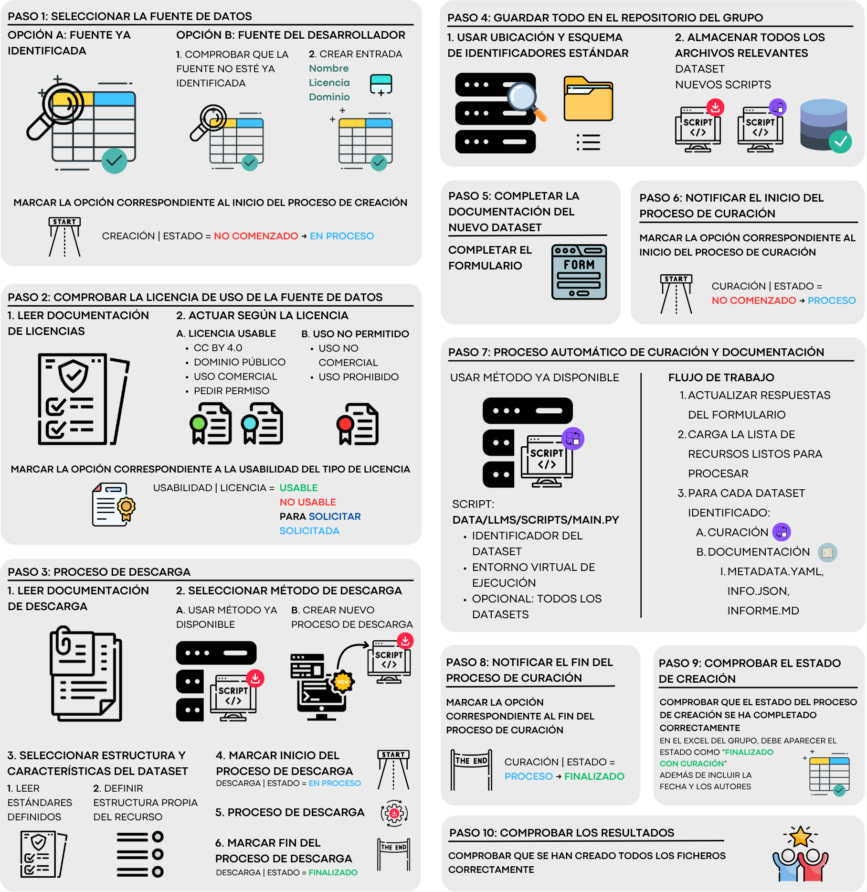

Descripción del proceso completo de creación de un dataset para el grupo SINAI.

*Sara Dueñas Romero | sduenas@ujaen.es | Proyecto ALIA*

**Tabla de contenido**
- [Flujo de Trabajo a seguir](#flujo-de-trabajo-a-seguir)
  - [Pasos principales](#pasos-principales)
    - [Esquemas resumen del flujo de trabajo](#esquemas-resumen-del-flujo-de-trabajo)
  - [Descripción de los pasos](#descripción-de-los-pasos)
    - [Paso 1: Elección de la fuente de datos a descargar](#paso-1-elección-de-la-fuente-de-datos-a-descargar)
    - [Paso 2: Comprobar la licencia de uso de la fuente de datos](#paso-2-comprobar-la-licencia-de-uso-de-la-fuente-de-datos)
    - [Paso 3: Proceso de Descarga](#paso-3-proceso-de-descarga)
    - [Paso 4: Guardar todos los ficheros en el repositorio](#paso-4-guardar-todos-los-ficheros-en-el-repositorio)
    - [Paso 5: Completar la documentación del nuevo dataset](#paso-5-completar-la-documentación-del-nuevo-dataset)
    - [Paso 6: Notificar inicio del Proceso de Curación](#paso-6-notificar-inicio-del-proceso-de-curación)
    - [Paso 7: Procesos automáticos de Curación y Documentación](#paso-7-procesos-automáticos-de-curación-y-documentación)
    - [Paso 8: Notificar el fin del Proceso de Curación](#paso-8-notificar-el-fin-del-proceso-de-curación)
    - [Paso 9: Comprobar el estado de la creación del dataset en el Excel del grupo](#paso-9-comprobar-el-estado-de-la-creación-del-dataset-en-el-excel-del-grupo)
    - [Paso 10: Comprobar el correcto funcionamiento del flujo completo](#paso-10-comprobar-el-correcto-funcionamiento-del-flujo-completo)

---

# Flujo de Trabajo a seguir

En este documento vamos a explicar **cómo se tiene que proceder para crear un nuevo dataset para el grupo SINAI**. Este procedimiento está formado por unos pasos ***fijos*** y ***obligatorios***, se deben ***realizar exclusivamente en el orden indicado***.

## Pasos principales

**Paso 1: Fuente de datos a descargar**

A. Elegir un recurso ya identificado en el excel del grupo

B. Elegir una nueva fuente de datos
1. Comprobar su existencia en el excel del grupo
      - En caso de que no exista: Añadir una nueva entrada


**Paso 2: Comprobar la licencia de uso de la fuente de datos**

1. Leer la documentación de licencias
2. Según la licencia de uso de datos:
   - 2.A. Si la fuente de datos está bajo una licencia usable
       - A.1. Marcar la entrada correspondiente en el excel del grupo``[Usabilidad Licencia] = "Desconocido" -> "Usable"``
       - A.2. Proceder con el resto del flujo de trabajo 
   - 2.B. Si la fuente de datos está bajo una licencia no usable: marcar la entrada correspondiente en el excel del grupo ``[Usabilidad Licencia] = "Desconocido" -> "No usable"``

**Paso 3: Proceso de descarga**

1. Leer la documentación de descarga
2. Seleccionar el método de descarga
   - 2.A. Utilizar un método de descarga ya disponible en los recursos del grupo
   - 2.B. Crear un nuevo proceso de descarga general/específico para el nuevo recurso
3. Seleccionar la estructura y características del nuevo dataset
   - 3.1. Comprobar los estándares definidos para todos los datasets del grupo
   - 3.2. Definir la estructura propia del recurso
4. Notificar el inicio del proceso de descarga en el excel del grupo  ``[Descarga Estado] = "No comenzado" -> "En proceso"``
5. Proceder con la descarga
6. Notificar el fin del proceso de descarga en el excel del grupo  ``[Descarga Estado] = "En proceso" -> "Finalizado" + Fecha + Autor``

**Paso 4: Guardar todos los ficheros en el repositorio**

**Paso 5: Completar la documentación del nuevo dataset y guardar los ficheros en el repositorio**

1. Completar el formulario [*SINAI Corpus | Complete Documentation Form*](https://forms.gle/teZXMMmmxacViD2o6) en Google Drive

**Paso 6: Notificar el inicio del proceso de curación** ``[Curación Estado] = "No comenzado" -> "En proceso"``

**Paso 7: Procesos automáticos de curación y documentación** 

1. Leer la documentación de curación y documentación de datasets
2. Proceder con la curación y documentación: ejecutar el programa ``main.py`` indicando el dataset deseado

**Paso 8: Notificar el fin del proceso de curación** ``[Curación Estado] = "En proceso" -> "Finalizado" + Fecha + Autor``

**Paso 9: Comprobar el estado del proceso de creación** ``[Curación Estado] = "Finalizado con curación" + Fecha + Autor``

**Paso 10: Comprobar que todos los ficheros estén correctamente creados y en la ubicación correspondiente**


### Esquemas resumen del flujo de trabajo

```pgsql
1. Elección de la fuente de datos a descargar
   ├─ A. Fuente ya identificada en el Excel
   └─ B. Nueva fuente de datos
      ├─ 1. Comprobar si existe en el Excel
      └─ 2. Si no existe, añadir nueva entrada

2. Comprobar la licencia de uso de la fuente de datos
   ├─ 1. Leer la documentación de licencias
   └─ 2. Según la licencia:
        ├─ A. Licencia usable
        │    ├─ A.1. Marcar la licencia como 'usable'
        │    └─ A.2. Proceder con el flujo
        └─ B. Licencia no usable
             └─ B.1. Marcar la licencia como 'No Usable'
             └─ B.2. Detener flujo para esta fuente

3. Proceso de descarga
   ├─ 1. Leer documentación de descarga
   ├─ 2. Seleccionar método de descarga
   │    ├─ 2.A. Usar método ya disponible
   │    └─ 2.B. Crear nuevo proceso de descarga
   ├─ 3. Seleccionar estructura y características del dataset
   │    ├─ 3.1. Comprobar estándares definidos
   │    └─ 3.2. Definir estructura propia del recurso
   ├─ 4. Notificar inicio de descarga
   ├─ 5. Proceder con la descarga
   └─ 6. Notificar fin de descarga

4. Guardar el nuevo dataset en el repositorio del grupo
   ├─ 1. Usar ubicación y esquema de identificadores estándar
   └─ 2. Almacenar todos los archivos relevantes (datos, scripts)

5. Completar la documentación del nuevo dataset
   └─ 1. Completar formulario "SINAI Corpus | Complete Documentation Form"

6. Notificar inicio de curación

7. Proceso de curación y documentación
   ├─ 1. Leer documentación de curación
   ├─ 2. Notificar inicio de curación
   ├─ 3. Proceder con la curación y la documentación automática del dataset (main.py)
   └─ 4. Notificar fin de curación

8. Notificar fin de curación

9. Comprobar el fin del proceso de creación

10. Comprobar la correcta ejecución y resultados del flujo de trabajo empleado
```



## Descripción de los pasos 

### Paso 1: Elección de la fuente de datos a descargar

El primer paso consiste en **identificar qué recurso se va a utilizar para generar el nuevo dataset**. Existen dos opciones:

**Opción A: Fuente ya identificada.** 
Si el recurso ya se encuentra registrado en el [Excel del grupo](https://docs.google.com/spreadsheets/d/1rV2PNU2N4EtvJ5mJxDsE8jkb1v_r2iPdDuAVzv7NndA/edit?usp=sharing), simplemente hay que localizarlo y cambiar el campo ``[Creación Estado] = "En proceso"``, indicando que se va a iniciar el proceso.

**Opción B: Nueva fuente.** 
Si se trata de una nueva fuente de datos que no está en el Excel, se debe:

  1. Comprobar su ausencia en el fichero.

  2. Añadir una nueva entrada con la información básica del recurso.
     - **Nombre**: nombre que del dataset (columna 'A')
     - **Acceso al recurso**: link de la web de descarga (columna 'O')
     - [Opcional] **Notas**: cualquier comentario sobre el dataset (columna 'P')

Este paso es fundamental para mantener la trazabilidad y evitar duplicidades en el trabajo del grupo.

### Paso 2: Comprobar la licencia de uso de la fuente de datos

Antes de proceder con cualquier tipo de descarga o manipulación, es imprescindible comprobar que **la fuente de datos tiene una licencia compatible con el uso en proyectos de investigación y distribución** del grupo.

1. En primer lugar, se debe revisar la [documentación de licencias proporcionada](/documentation/data/llms/plain/standard_licenses.md#estándar-de-licencias-para-el-grupo-sinai). 
<br>

1. A partir de ahí:<br>
   **Opción A: Fuente con licencia usable.**
   Si la licencia es usable, es decir, se encuentra en la lista de licencias usables de la [documentación de licencias proporcionada](/documentation/data/llms/plain/standard_licenses.md#estándar-de-licencias-para-el-grupo-sinai) o bien se indica expresamente que su uso es 'libre' o 'aceptado para uso comercial'.
   - Marcar en el [Excel del grupo](https://docs.google.com/spreadsheets/d/1rV2PNU2N4EtvJ5mJxDsE8jkb1v_r2iPdDuAVzv7NndA/edit?usp=sharing) la fuente como ``[Usabilidad Licencia] = “Usable”``
   <br>
   
   **Opción B: Fuente con licencia no usable.**
   Si la licencia es incompatible (por ejemplo, uso comercial exclusivo, derechos reservados sin cesión), 
   - Marcar en el [Excel del grupo](https://docs.google.com/spreadsheets/d/1rV2PNU2N4EtvJ5mJxDsE8jkb1v_r2iPdDuAVzv7NndA/edit?usp=sharing) la fuente como ``[Usabilidad Licencia] = “No Usable”``
   - Se descartará el recurso.
   <br>

   **Opción C: Usable bajo solicitud.**
   Es posible que algunas fuentes de datos indiquen realizar una solicitud previa para poder utilizar los datos para fines comerciales. En este caso marcaremos:
   - Marcar en el [Excel del grupo](https://docs.google.com/spreadsheets/d/1rV2PNU2N4EtvJ5mJxDsE8jkb1v_r2iPdDuAVzv7NndA/edit?usp=sharing) la fuente como ``[Usabilidad Licencia] = “Solicitar”`` cuando sea necesaria y NO se vaya realizado la solicitud (contactar con los coordinadores del grupo de datos)
   - Marcar en el [Excel del grupo](https://docs.google.com/spreadsheets/d/1rV2PNU2N4EtvJ5mJxDsE8jkb1v_r2iPdDuAVzv7NndA/edit?usp=sharing) la fuente como ``[Usabilidad Licencia] = “Solicitada”`` cuando sea necesaria y se vaya realizado la solicitud. Se deberá marcar como “Usable” o “No Usable” en el momento en que los responsables de lafuente de datos contesten a la solicitud.

### Paso 3: Proceso de Descarga

Esta fase comprende la **adquisición efectiva del recurso** y la **preparación inicial del dataset**.

**1. Comienza con la lectura del [procedimiento standardizado de descarga](/documentation/data/llms/plain/process_download.md)**, que proporciona recomendaciones técnicas y herramientas disponibles a emplear.
<br>

**2. Se seleccionará un método de descarga**:
- **Opción A. Método ya disponible.**
   Puede ser uno ya existente y documentado por un desarrollador del grupo.
   <br>
- **Opción B. Creación de un nuevo método.**
   Quizás es necesario crear un script o proceso nuevo para recursos específicos.
   <br>

**3. A continuación, se define la estructura que tendrá el dataset:**

   1. Estudiar los [estándares generales del grupo](/documentation/data/llms/plain/standard_dataset_structure.md).

   2. Diseñando una estructura en base a estos estándares.
<br>

**4. Es obligatorio notificar el inicio de esta etapa en el [Excel del grupo](https://docs.google.com/spreadsheets/d/1rV2PNU2N4EtvJ5mJxDsE8jkb1v_r2iPdDuAVzv7NndA/edit?usp=sharing)**, cambiando ``[Descarga Estado] = "No comenzado" -> "En proceso"``.
<br>

**5. Este proceso debe incluir la extracción del texto de los documentos que se descarguen** (si la fuente de datos está compuesta por documentos que deben er leídos).

Tras **finalizar la descarga**, debe actualizarse el estado ``[Descarga Estado] = "En proceso" -> "Finalizado"``, incluyendo la *fecha de finalización* (columna 'G') y el *nombre del desarrollador responsable* (columna 'H').
- Si se ha incluído la extracción del texto de los documentos se deberá actualizar el estado  ``[Procesamiento (lectura de PDFs)] = "No comenzado" -> "Finalizado"``


### Paso 4: Guardar todos los ficheros en el repositorio

Se deben almacenar todos los ficheros creados hasta el momento del proceso en el [repositorio de almacenamiento común para ALIA](https://ceatic.ujaen.es/gitlab/sinai/alia/-/tree/main?ref_type=heads) a través del servidor interno del CEATIC.

En caso de **no tener acceso al servidor interno**: contactar con los coordinadores del grupo de datos.
- [sduenas](sduenas@ujaen.es)
- [ammunoz](ammunoz@ujaen.es)

En caso de **tener acceso al servidor interno** y al **directorio del repositorio**:
 1. Almacenar los scripts de descarga en su carpeta correspondiente (ver [procedimiento standardizado de descarga](data/llms/documentation/processes/process_download.md))
 2. Almacenar los archivos descargados originales de la fuente de datos en el directorio correspondiente ``data/raw/{dominio}/{identificador del dataset}``
 3. Almacenar los archivos en el formato parquet deseado  ``data/interim/{dominio}/{identificador del dataset}``

Esto ***garantiza la accesibilidad y reutilización del recurso*** por parte de todo el equipo.

### Paso 5: Completar la documentación del nuevo dataset

Una vez que el dataset está curado y preparado, es momento de **documentarlo correctamente**.

- Se debe completar el [formulario de documentación disponible en el Google Drive del grupo](https://forms.gle/teZXMMmmxacViD2o6), que recoge los metadatos principales del dataset (fuente, cobertura temporal, temática, idioma, etc.).

### Paso 6: Notificar inicio del Proceso de Curación

Se debe indicar en el [Excel del grupo](https://docs.google.com/spreadsheets/d/1rV2PNU2N4EtvJ5mJxDsE8jkb1v_r2iPdDuAVzv7NndA/edit?usp=sharing) que la curación ha comenzado, cambiando el estado ``[Curación Estado] = "No comenzado" -> "En proceso"``.

### Paso 7: Procesos automáticos de Curación y Documentación

En esta fase se lleva a cabo la **limpieza, normalización y estructuración adecuada de los datos** descargados y la documentación del dataset resultante.

Es necesario que los ficheros se hayan almacenado correctamente en el [Paso 4](#paso-4-guardar-todos-los-ficheros-en-el-repositorio) y se haya completado el formulario en el [Paso 5](#paso-5-completar-la-documentación-del-nuevo-dataset).

1. El proceso comienza con la lectura del [documento de curación de datos](data/documentation/processes/process_curation.md), que explica cómo funciona el sistema automático de curación de los datos.

2. Se debe indicar en el [Excel del grupo](https://docs.google.com/spreadsheets/d/1rV2PNU2N4EtvJ5mJxDsE8jkb1v_r2iPdDuAVzv7NndA/edit?usp=sharing) que la curación ha comenzado, cambiando el estado ``[Curación Estado] = "No comenzado" -> "En proceso"``.

   El trabajo de curación incluye tareas como:
   - **eliminación** de duplicados, 
   - **normalización** de campos, 
   - eliminación de **ruido** o formato no deseado
   - y conteo de token por cada instancia del dataset

3. Se continúa con la lectura tanto del [Estándar de Metadatos](/documentation/data/llms/plain/standard_metadata.md) para los datasets del proyecto como el [Proceso de creación de documentación](/documentation/data/llms/plain/process_metadata.md) de los mismos.

4. Una vez se haya entendido el proceso que se va a realizar, se procederá con la ejecución automática con ayuda del script [main.py](/data/llms/scripts/main.py):
   1. Argumentos
   2. Ejecución desde el directorio ``/alia``: 
      1. Dataset único: `python data/llms/scripts/main.py --env <entorno virtual> --id <identificador del dataset>`
      2. Todos los datasets disponibles para curar y documentar: `python data/llms/scripts/main.py --env <entorno virtual> --all`

Al **finalizar la curación de los datos** del dataset, se actualiza el estado a ``[Curación Estado] = "En proceso" -> "Finalizado"``, registrando también la *fecha* y el *autor responsable*.


### Paso 8: Notificar el fin del Proceso de Curación

Una vez cumplidos todos los pasos anteriores (descarga, curación y documentación), se da por **finalizado el proceso de curación y documentación del dataset**.

Esto debe reflejarse en el [Excel del grupo](https://docs.google.com/spreadsheets/d/1rV2PNU2N4EtvJ5mJxDsE8jkb1v_r2iPdDuAVzv7NndA/edit?usp=sharing) modificando el estado de ``[Creación Estado] = "En proceso" -> "Finalizado"``.

### Paso 9: Comprobar el estado de la creación del dataset en el Excel del grupo

En este Excel del grupo, si se ha marcado correctamente el estado de cada paso del proceso, el EStado de Creación debería haber cambiado para reflejar:
1. No comenzado: al inicio del proceso
2. En proceso
3. Finalizado sin curación: antes del proceso de curación y documentación
4. Finalizado con curación: al final del proceso

Además, la fecha de finalización se corresponderá con la del último proceso realizado.

### Paso 10: Comprobar el correcto funcionamiento del flujo completo

Comprobar que se han creado todos los ficheros dentro del directorio del dataset.

- En `data/llms/data/processed/{dominio}/{identificador del dataset}/`:
  - dataset.parquet: fichero que contiene los datos del dataset
  - duplicated_rows.csv: fichero que contiene los identificadores de las instancias duplicadas que se han eliminado
  - info.json: fichero de información de datos básicos del dataset
  - metadata.yaml: fichero que contiene los metadatos del dataset
  - datasheet_informe_es.md: informe con toda la información del dataset
  - datasheet_report_en.md: informe con toda la información del dataset
  - datasheet.csv: respuestas del formulario de documentación

- En `/documentation/data/llms/plain/datasets`:
  - Tabla con los tokens y la información de cada dataset: [info_datasets.csv](/documentation/data/llms/plain/datasets/info_datasets.csv)
  - Tabla con los tokens de cada dominio: [info_domains.csv](/documentation/data/llms/plain/datasets/info_domains.csv)
  - Listado de los datasets disponibles: [dossier.md](/documentation/data/llms/plain/datasets/dossier.md)
